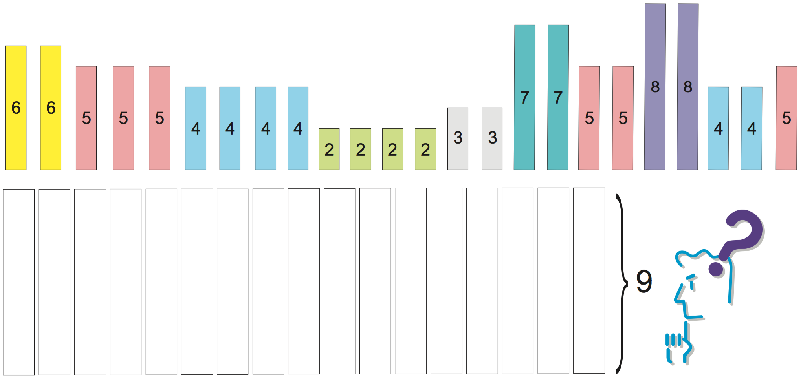

# Practice on Column Generation


## Task 1

Give an extensive formulation of the multicommodity flow problem and
show that it can be derived by Dantzig Wolfe decomposition of the
previously seen (compact) arc flow formulation. 

- What is the complete Master Problem?
- What is the column generation subproblem?

## Task 2

Consider generalized assignment problem with equality constraints:

$$
\begin{align}
\max &\sum_{i=1}^m\sum_{j=1}^n c_{ij}x_{ij}\\
&\sum_{j=1}^n x_{ij}= 1 \qquad  i = 1,\ldots, m\\
&\sum_{i=1}^m a_{ij} x_{ij}\leq  b_j \qquad  j = 1,\ldots,n\\
&x \in \{0, 1\}^{mn}.
\end{align}
$$

Solve an instance by delayed column generation treating the constraints $\sum_{j=1}^n x_{ij}= 1, i = 1,\ldots, m$ as the complicating ones
and 

$$m=3,n=2$$

$$[a_{ij}]=\begin{bmatrix}5&3\\\\3&8\\\\2&10\end{bmatrix},\,[c_{ij}]=\begin{bmatrix}20&16\\\\15&19\\\\19&14\end{bmatrix},\,
[b_j]=\begin{bmatrix}6\\\\21\end{bmatrix}
$$

## Task 3


You are the person in charge of packing in a large company. Your job
is to skillfully pack items of various weights in a box with a
predetermined capacity; your aim is to use as few boxes as
possible. Each of the items has a known weight and the upper limit of
the contents that can be packed in a box is 9 kg. There is no concern
with the volume they occupy. So, how should these items be packed?

|Weights of items to be packed in bins of size 9|
|-----------------------------------------------------------------------|
|6, 6, 5, 5, 5, 4, 4, 4, 4, 2, 2, 2, 2, 3, 3, 7, 7, 5, 5, 8, 8, 4, 4, 5|

<div style="text-align:center;">

</div>

This is an example of a problem called the *bin packing problem*. It can
be described mathematically as follows.

Bin packing problem

There are $n$ items to be packed and an infinite number of available bins
of size $B$. The sizes $0\leq s_i \leq B$ of individual items are assumed to be
known. The problem is to determine how to pack these $n$ items in bins of
size $B$ so that the number of required bins is minimum.

1. Formulate the problem using a compact formulation and an extensive
formulation. 

2. Solve the given example using the extensive formulation. Solve the linear relaxation of the master problem by column generation and draw a plot about the dual bound development during the process. 

3. Continue the process with branch and price if the solution found at the previous point is not integral.

```python

def BinPackingExample():
    B = 9
    s = [6, 6, 5, 5, 5, 4, 4, 4, 4, 2, 2, 2, 2, 3, 3, 7, 7, 5, 5, 8, 8, 4, 4, 5]
    return s,B


def FFD(s, B):
    remain = [B]
    sol = [[]]
    for item in sorted(s, reverse=True):
        for j,free in enumerate(remain):
            if free >= item:
                remain[j] -= item
                sol[j].append(item)
                break
        else:
            sol.append([item])
            remain.append(B-item)
    return sol

```

You find these data and some starting templates for your implementations
in Python in our git repository:

- A template for the compact formulation: `compact_template.py`.

- A template for the extended formulation with delayed column generation: `extensive_template.py`

To add columns to your model without resolving from
scratch see:

- In `gurobipy`, the last example from this doumentation page:
  [Modify a model (gurobi.com)](https://www.gurobi.com/documentation/10.0/examples/modify_a_model.html)

- In Python MIP see documentation for `Column` and `add_var`.

- In Pyomo see
  [cutting_stock.py](https://github.com/Pyomo/pyomo/blob/main/examples/pyomo/columngeneration/cutting_stock.py)

- In Pyscipopt there is a different philosophy. See
  [test_pricer.py](https://github.com/Pyomo/pyomo/blob/main/examples/pyomo/columngeneration/cutting_stock.py). Alternatively
  it is possible to follow this [example](../assets/cutstock.py).

# Task 4

In Task 3, we were lucky for the examples tested that the heuristic solution of
the FFD algorithm was proven optimal by the lower bound found solving the LMP.
When that is not the case we need to continue by branch-and-price or
branch-and-cut-and-price. 

Design a branch-and-price algorithm for your extensive formulation of the bin
packing problem developed above. You can use as a reference the skeleton given
on page 121 of [Wo] and define the branching scheme and its implications on the
pricing problem. You can try to perform the branch-and-price by hand using the
methods implemented in the previous sheet (ignoring the result of the FFD
heuristic).

Implementations:

- gurobi does not provide support for variable addition at the nodes of the
  solver branch and bound via callback. Hence, using gurobi you would need to
  reimplement the whole branch and bound algorithm, solving from scratch a
  column generation at every node of the tree.

- pyscipopt provides support by defining a class inherited from Pricer. The
  script test_pricing.py from the pyscipopt github repository shows how to do
  this.
